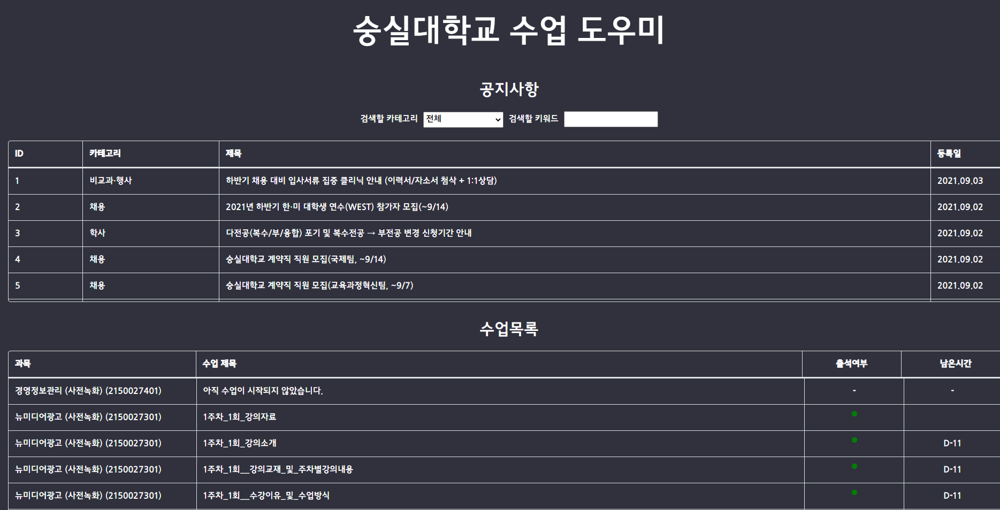

# SoongsilStudyHelper
숭실대학교 학습도우미 - 공지사항과 온라인 강의의 진행도, 과제에 대한 알림을 줍니다.

### 서비스 화면

### 기능
#### 1차 
* 공지사항과 수강하고 있는 수업을 크롤링해와서 한 페이지에서 보여준다.
#### 2차 (예정)
* 특정 키워드에 대한 알림 기능
* 공지사항 바로가기 링크
* 수업 바로가기 링크

### 사용한 기술
* java
* Spring boot
* Selenium

### 개발 리스트 - 1차

  - [x] 크롤링 서비스 만들기

  - [x] 크롤링 서비스 - Entity 생성

  - [x] 크롤링 서비스 - Notice DTO 생성
  
  - [x] 크롤링 서비스 - 공지사항 가져오기
  
  - [x] 크롤링 서비스 - 가져온 공지사항 정보 DB에 저장 (annotation)
  
  - [x] 크롤링 서비스 - 마지막 id로부터 새로 생성된 공지사항만 가져올 수 있도록 기능 구현
  
  - [x] 웹 서비스 만들기
  
  - [x] 웹 서비스 - Entity 생성
  
  - [x] 웹 서비스 - Notice DTO 생성
  
  - [x] 웹 서비스 - 컨트롤러 생성 (GetNotice)
  
  - [X] 웹 서비스 - 가져온 공지사항 화면에 뿌려주기 - 한 페이지 당 5개, 셀렉트 박스로 tag 선택 기능
  
  - [X] 결과 확인

### 참고한 블로그
* 자바 패키지 분류법
    - https://12bme.tistory.com/271
  